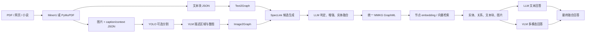

# MMGraphRAG 逐步输出、典型案例与多模型实测

> 生成日期：2026-09-11  
> 工作区：`/private/mmkg`  
> 论文版本：[MMGraphRAG, arXiv:2507.20804v2](https://arxiv.org/html/2507.20804v2)  
> 复现脚本：[`benchmark_embedding_candidates.py`](./benchmark_embedding_candidates.py)

## 0. 先给结论

1. **这个工程需要 embedding 模型。** 它至少出现在两个位置：
   - 构图/融合阶段：SpecLink 用实体描述 embedding 构造“语义相似度 × 图关系权重”的谱聚类矩阵，再为图像实体选择候选簇。
   - 检索阶段：为最终 MMKG 节点生成向量，问题向量与节点向量做余弦检索。
2. 不必限定为 BGE。官方示例使用 `all-MiniLM-L6-v2`，论文完整 CMEL 实验还比较了 MiniLM、BGE-M3 和 Stella，并在 SpecLink 中统一使用 Stella。
3. 如果只是阅读仓库已有 GraphML/JSON，或复用已经生成的 `*_emb.npy`，可以暂时不下载；**从头构图、换文档、换 embedding 维度或重建向量库时必须可用。**
4. 本机候选层实测中，Stella 官方依赖栈的细粒度实体对齐 `R@3=68.37%`，高于 MiniLM 的 `58.67%` 和 BGE-M3 的 `54.59%`。但 BGE-M3 在 `BABY IN RED HAT → DUDLEY` 这个具体难例上最好，说明不存在“所有样例上绝对最优”的单模型。
5. embedding 只能缩小候选范围；最终效果仍依赖 VLM/LLM 的视觉实体抽取、候选判定和实体融合。离线 stub 全链路三组均为 0 分，正好说明不能把 embedding 候选召回误当成端到端 CMEL 准确率。
6. 本次新增同协议端到端实测：Qwen3.8-Flash-Next-FP8 在固定 dev12 上达到
   **56.1% micro / 63.1% macro**，比 Qwen3.8-27B 的 53.1% / 58.0% 提高
   **3.0 / 5.1 个百分点**。该开发集只用于冻结后续裁决配置。
7. Flash temperature=0 的完整集结果为 **48.1% / 55.4%**，未超过论文
   51.8% / 59.2%；27B 单模为 **48.9% / 51.8%**，同样未超过。
8. dev12 冻结的“Flash/27B 候选 + 27B candidate-ID 裁决”在完整集达到
   **56.3% / 61.3%**，相对论文 **+4.5/+2.1 pp**，678 图、1,114 条、0 缺失；这是本次
   正式主结果。同时报告链接 F1=41.7%，明确其仍低于 27B 单模 F1=43.3%。

## 1. 证据口径

本文用三个标签避免混淆：

- **[本次实测]**：本次在两张 NVIDIA L20X 上真实执行并落盘的结果。
- **[仓库既有运行]**：`/private/mmkg/repro/runs` 中此前已有的真实运行，未在本次重新调用其 API。
- **[官方产物/论文]**：官方示例目录、官方运行日志或论文报告值；本次只读取和核验，没有声称重新生成。

它们不可直接混为同一张排行榜：样本范围、模型、提示词、依赖版本及是否调用在线 LLM/VLM 均可能不同。

## 2. 环境与模型

### 2.1 本机环境

| 项目 | 值 |
|---|---|
| GPU | 2 × NVIDIA L20X |
| 主环境 | Python 3.13.13, Torch 2.14.0+cu130, Transformers 5.16.1, Sentence-Transformers 6.0.1 |
| Stella 隔离环境 | Python 3.10.12, Torch 2.3.1+cu121, Transformers 4.42.3, Sentence-Transformers 3.0.1 |
| 数据 | CMEL 的 news / novel / paper 三域 |
| 固定抽样 | `seed=0`，每域 4 篇，共 12 篇、136 张图、196 条细粒度标注 |
| embedding 阈值 | 0.35，与复现代码默认值一致 |
| API 状态 | 本地 vLLM OpenAI-compatible endpoint；Qwen3.8-27B 与 Flash 均完成文本/真实图片 smoke test |

### 2.2 已缓存并实测的 embedding 模型

| 模型 | 输出维度 | 用途/特点 | 本次状态 |
|---|---:|---|---|
| `sentence-transformers/all-MiniLM-L6-v2` | 384 | 轻量、CPU 也可跑；官方示例默认 | 已有缓存，实测 |
| `BAAI/bge-m3` | 1024 | 多语言，分数整体比 MiniLM 高，阈值需重新标定 | 本次下载，实测 |
| `NovaSearch/stella_en_1.5B_v5` | 1024 | 论文 embedding/SpecLink 选择；模型卡支持多维投影 | 本次下载，官方依赖栈实测 |

Stella 模型卡说明其默认向量为 1024 维，并提供 `s2p_query`、`s2s_query` 两种查询提示；本报告的主结果为了与 MMGraphRAG 原代码 `model.encode(...)` 对齐，采用**无额外 prompt**的编码方式。模型卡见 [Hugging Face](https://huggingface.co/NovaSearch/stella_en_1.5B_v5)。

### 2.3 本地模型统一入口

本机模型统一从 `/root/models` 引用。Qwen 权重直接存放于该目录，三个 embedding 模型通过符号链接指向 Hugging Face snapshot，因此不会复制权重，也不会破坏 snapshot 内部指向 `blobs/` 的相对链接。

| 类型 | 模型 | 稳定本地路径 |
|---|---|---|
| VLM | `Qwen3.8-27B` | `/root/models/Qwen3.8-27B` |
| VLM | `Qwen3.8-Flash-Next-FP8` | `/root/models/Qwen3.8-Flash-Next-FP8` |
| EMB | `sentence-transformers/all-MiniLM-L6-v2` | `/root/models/all-MiniLM-L6-v2` |
| EMB | `BAAI/bge-m3` | `/root/models/bge-m3` |
| EMB | `NovaSearch/stella_en_1.5B_v5` | `/root/models/stella_en_1.5B_v5` |

机器可读注册表见 `/root/models/models.json`；维护说明见 `/root/models/README.md`。

## 3. MMGraphRAG 从输入到回答的输出链



仓库代码入口与实际数据流一致：

| 阶段 | 代码入口 | 主要落盘输出 |
|---|---|---|
| PDF 预处理 | [`PdfChunking.extract_text_and_images`](../MMGraphRAG-main/src/preprocessing/pdf_preprocessing.py#L254) | `kv_store_text_chunks.json`、`kv_store_image_data.json`、图片 |
| 图片描述 | [`get_image_description`](../MMGraphRAG-main/src/preprocessing/pdf_preprocessing.py#L172) | 每图 `description`、`segmentation`、`chunk_order_index` |
| Image2Graph | [`img2graph`](../MMGraphRAG-main/src/graph/img2graph.py#L413) | 每图 `graph_*_entity_relation.graphml` |
| 跨模态融合 | [`fusion`](../MMGraphRAG-main/src/graph/fusion.py#L784) | enhanced/new/merged GraphML |
| 节点向量 | [`load_or_build_embeddings`](../MMGraphRAG-main/src/retrieval/query.py#L82) | `<graph_stem>_emb.npy` |
| 检索与生成 | [`GraphRAGQuery.query`](../MMGraphRAG-main/src/retrieval/query.py#L404) | `retrieval_log.md`、最终回答 |

## 4. 典型案例 A：Table 10 的最高 F1 是多少？

### 4.1 输入

**[官方产物/论文]** 文档是 ACL 论文 `2020.acl-main.45`，问题为：

> What is the highest F1 score achieved on the Chinese OntoNotes4.0 dataset, according to Table 10?

标准答案：**84.67（α = 0.6）**。

原图：


### 4.2 第一步：PDF 预处理

官方示例构建报告记录的输出为：

| 输出 | 数量/值 |
|---|---:|
| 文本块 | 16 |
| 图片 | 23 |
| 预处理器 | MinerU |
| `image_23.chunk_order_index` | 11 |
| `image_23.segmentation` | `false` |

`kv_store_image_data.json` 中该图的关键输出可压缩为：

```json
{
  "image_id": 23,
  "chunk_order_index": 11,
  "chunk_id": "chunk-190fb76ec24199346ebe1de20cc27c3d",
  "segmentation": false,
  "description": "Table 10 ... Chinese Onto4.0 ... 84.67 at alpha=0.6; English QuoRef ... 68.44 at alpha=0.4"
}
```

这里 VLM 已把表格像素线性化成可检索描述，但 MMGraphRAG 不止停在 caption：下一步还会把表格内部对象和关系显式建图。

实际文件：[`kv_store_image_data.json`](../MMGraphRAG-main/examples/example_working/kv_store_image_data.json)。

### 4.3 第二步：Text2Graph

文本块 11 产生的典型实体：

```json
[
  {"entity_name": "TABLE 10", "entity_type": "EVENT"},
  {"entity_name": "CHINESE ONTONOTES4.0 NER DATASET", "entity_type": "GEO"},
  {"entity_name": "ENGLISH QUOREF MRC DATASET", "entity_type": "GEO"}
]
```

典型关系：

```text
TABLE 10 --[contains results for, weight=9]--> CHINESE ONTONOTES4.0 NER DATASET
TABLE 10 --[contains results for, weight=9]--> ENGLISH QUOREF MRC DATASET
```

整篇文本图输出：**415 节点、214 边**。JSON 证据见 [`kv_store_chunk_knowledge_graph.json`](../MMGraphRAG-main/examples/example_working/kv_store_chunk_knowledge_graph.json)，GraphML 见 [`graph_chunk_entity_relation.graphml`](../MMGraphRAG-main/examples/example_working/graph_chunk_entity_relation.graphml)。

### 4.4 第三步：Image2Graph

由于 `segmentation=false`，本图不执行 YOLO 区域切分；VLM 直接抽取整图实体与关系。原始图像图输出为 **6 节点、12 边**：

| 图像节点 | 类型 | 关键描述输出 |
|---|---|---|
| `TABLE` | OBJECT | 三列十行的结构化表格 |
| `Α` | OBJECT | 0.1 至 0.9 的参数 |
| `CHINESE ONTO4.0` | ORGANIZATION | 峰值 84.67，α=0.6 |
| `ENGLISH QUOREF` | ORGANIZATION | 峰值 68.44，α=0.4 |
| `SCORE` | OBJECT | 两个数据集的性能数值 |
| `IMAGE_23` | ORI_IMG | 整张图的全局实体 |

典型显式边：

```text
Α --[influences, weight=8]--> CHINESE ONTO4.0
Α --[influences, weight=8]--> ENGLISH QUOREF
TABLE --[contains, weight=9]--> SCORE
CHINESE ONTO4.0 --[extracted from, weight=10]--> IMAGE_23
```

实际输出：[`graph_image_23_entity_relation.graphml`](../MMGraphRAG-main/examples/example_working/images/image_23/graph_image_23_entity_relation.graphml)。

### 4.5 第四步：SpecLink 候选生成与跨模态融合

候选池先被限制到图片对应文本块的前一块、当前块和后一块，即 `j-1, j, j+1`。SpecLink 再将两类信号结合：

```text
A[p,q] = cosine(embedding[p], embedding[q]) × relation_weight[p,q]
```

随后对拉普拉斯矩阵做谱分解和聚类，将图像实体分配到最相关簇，LLM 才在缩小后的候选中判定最终对齐。

本图真实中间文件对比显示：

| 子步骤 | 输入 → 输出 |
|---|---|
| 未对齐实体增强 | `Α` → `α (alpha)`；`SCORE` → `SCORE (F1-score)` |
| 全局图像实体对齐 | 新增文本节点 `TABLE 10` |
| 新增跨模态边 | `IMAGE_23 --is the image of--> TABLE 10` |
| 原始图像图 | 6 节点、12 边 |
| enhanced 图 | 6 节点、12 边 |
| updated 图 | 7 节点、13 边 |

对应文件：

- [`enhanced_graph_image_23_entity_relation.graphml`](../MMGraphRAG-main/examples/example_working/images/image_23/enhanced_graph_image_23_entity_relation.graphml)
- [`new_graph_image_23_entity_relation.graphml`](../MMGraphRAG-main/examples/example_working/images/image_23/new_graph_image_23_entity_relation.graphml)
- [`graph_merged_image_23.graphml`](../MMGraphRAG-main/examples/example_working/graph_merged_image_23.graphml)

全部 23 张图迭代融合后，最终 MMKG 从文本图的 **415 节点**增长到 **527 节点、646 边**，其中包含 23 个 `ORI_IMG` 节点。官方构建耗时 1922.06 秒，模型为 `qwen3-max + qwen-vl-max + all-MiniLM-L6-v2`。详见 [`example_mmkg_report.md`](../MMGraphRAG-main/examples/example_output/example_mmkg_report.md)。

### 4.6 第五步：节点向量化与问题检索

最终图的每个节点以 `description`（缺失时用节点名）编码，缓存为 [`example_mmkg_emb.npy`](../MMGraphRAG-main/examples/example_output/example_mmkg_emb.npy)。问题也编码后做余弦相似度检索，再沿图边找关系和来源文本块。

官方日志对该问题输出的 Top-5 实体为：

```text
1. SCORE (F1-score)
2. CHINESE ONTONOTES4.0 NER DATASET
3. CHINESE ONTONOTES4.0
4. F1 Score
5. F1
```

关键检索关系包括：

```text
CHINESE ONTONOTES4.0 NER DATASET -- TABLE 10
CHINESE ONTONOTES4.0 NER DATASET -- α (alpha), highest=84.67 at α=0.6
CHINESE ONTONOTES4.0 NER DATASET -- IMAGE_23
SCORE (F1-score) -- TABLE 10
```

文本来源同时返回 Table 10 的 HTML 行，包含 9 个 α 值和两列分数。完整证据见 [`retrieval_log.md`](../MMGraphRAG-main/examples/example_output/retrieval_log.md#L670)。

### 4.7 第六步：LLM/VLM 混合生成

这里有两条应分开的官方执行轨迹：

#### A. 仓库示例日志的实际轨迹

检索到的结构化实体描述和文本块已经包含 84.67，初始文本 LLM 直接输出：**84.67，α=0.6**。该次日志没有出现后续 Multimodal Processing 段。

原因可由代码解释：查询阶段只在 Top-K **实体列表**中寻找 `ORI_IMG`；本次 `IMAGE_23` 只出现在关系中，未进入 Top-5 实体，因此没有触发 query-time VLM。换句话说，这个仓库示例依靠“构图时 VLM 已写入图描述”完成回答。

#### B. 论文 Appendix C 展示的混合生成轨迹

论文同一问题的逐模型输出为：

| 分支 | 输出结果 | 是否正确 |
|---|---|---:|
| 文本 LLM | 判断现有表格数据不足 | 否 |
| MLLM response 1 | 从 Table 10 找到 84.67，α=0.6 | 是 |
| MLLM response 2 | 从 image 12 找到 84.67，α=0.6 | 是 |
| MLLM response 3 | 因未获得图片而拒绝分析 | 否 |
| MLLM 合并 | 采用两个一致的视觉答案 | 是 |
| 最终 LLM 融合 | 输出 84.67，α=0.6 | 是 |

这个例子体现混合生成的价值：单个分支可以失败，只要检索图片正确且至少一个 VLM读表成功，合并器仍可能恢复正确答案。不过它也暴露成本和不稳定性：一次问题可能触发多个 VLM 调用，且第三个分支可能拿不到图或拒答。

## 5. 典型案例 B：`BABY IN RED HAT → DUDLEY`

**[官方 CMEL 标注 + 本次 embedding 实测]** 该例来自《Harry Potter and the Sorcerer's Stone》插图文档第 1 册的 `image_2`。

标注把三个视觉实体融合到同一个文本实体：

```json
[
  {"source_image_entities": ["BABY IN RED HAT"], "source_text_entities": ["DUDLEY"]},
  {"source_image_entities": ["BABY IN BEE COSTUME"], "source_text_entities": ["DUDLEY"]},
  {"source_image_entities": ["BABY IN GREEN HAT"], "source_text_entities": ["DUDLEY"]}
]
```

这是一个典型的“视觉外观词 ≠ 文本专名”难例：仅凭红帽婴儿的描述无法直接得到 Dudley，必须结合相邻文本、多个图像实体和图结构。

### 5.1 三模型对 `BABY IN RED HAT` 的候选输出

| 模型 | Top-3 候选（余弦分数） | DUDLEY 排名 | 结论 |
|---|---|---:|---|
| MiniLM | TINY OLD MAN 0.1970; LOUISE 0.1677; DI 0.1596 | 17 | Top-3 与阈值均漏召回 |
| BGE-M3 | TINY OLD MAN 0.4628; TABBY CAT 0.4492; **DUDLEY 0.4083** | 3 | 唯一在 Top-3 且过 0.35 |
| Stella（官方栈） | TINY OLD MAN 0.4250; THE POTTERS 0.3664; TABBY CAT 0.3535 | 10 | Top-3 漏召回 |

对三个婴儿实体，BGE-M3 的 DUDLEY 排名分别为 3、2、3；MiniLM 为 17、9、17；Stella 为 10、9、11。这个局部结果与全局平均并不矛盾：Stella 在 12 文档总体最好，但 BGE 对这个具体语义鸿沟更稳。

完整标注见 [`aligned_text_entity.json`](<../CMEL-dataset-main/CMEL_dataset/novel/Harry Potter and the Sorcerers Stone Illustrated Edition (J. K. Rowling, Jim Kay (Illustrator)) (1)/aligned_text_entity.json>)；三组逐条结果见：

- [`dudley_candidate_minilm.json`](./runs/dudley_candidate_minilm.json)
- [`dudley_candidate_bgem3.json`](./runs/dudley_candidate_bgem3.json)
- [`dudley_candidate_stella.json`](./runs/dudley_candidate_stella.json)

## 6. 本次三模型候选层实测

### 6.1 测什么

为了不让离线 LLM/VLM stub 污染 embedding 对比，本次增加了一个**候选生成消融**：

- Task1-like：用已标注的整图实体描述，在相邻文本实体中检索；排除 `no match`，所以 `n=110`。
- Task2-like：用局部视觉实体描述，在相邻文本实体中检索；`n=196`。
- `candidate oracle`：金标准实体是否存在于 `j-1/j/j+1` 候选池。
- `R@1/R@3`：按余弦相似度排序后，金标准是否进入前 1/3。
- `threshold R@3`：金标准既进入 Top-3，又达到原代码阈值 0.35。

该指标只评价 LLM 判定前的 embedding 候选层，**不能与论文最终 micro/macro accuracy 直接比较**。

### 6.2 总体结果

**[本次实测]** 固定相同的 12 文档：

| 模型 | Task1-like R@1 | Task1-like R@3 | Task2-like R@1 | Task2-like R@3 | Task2 阈值 R@3 | Task2 MRR |
|---|---:|---:|---:|---:|---:|---:|
| MiniLM | **90.91%** | 93.64% | 39.29% | 58.67% | 40.31% | 0.5309 |
| BGE-M3 | 88.18% | 93.64% | 35.20% | 54.59% | 54.59% | 0.4969 |
| Stella（官方栈） | 90.00% | 93.64% | **47.96%** | **68.37%** | **67.86%** | **0.6197** |

候选池本身的 Task2 oracle 为 99.49%，说明主要损失来自候选排序/筛选，而不是 `j±1` 的局部范围。

### 6.3 细粒度 Task2 分域 R@3

| 模型 | News (n=16) | Novel (n=116) | Paper (n=64) | Overall |
|---|---:|---:|---:|---:|
| MiniLM | 50.00% | 64.66% | 50.00% | 58.67% |
| BGE-M3 | 56.25% | 49.14% | 64.06% | 54.59% |
| Stella（官方栈） | **68.75%** | **69.83%** | **65.62%** | **68.37%** |

观察：

- MiniLM 的原始 Top-3 不差，但固定阈值使 Task2 有 18.36 个百分点的额外损失；它的余弦分数标定明显更低。
- BGE-M3 的 `R@3` 与阈值 `R@3` 完全相同，说明 0.35 对 BGE 较宽松。
- Stella 在三域都最稳定，但必须使用兼容依赖栈。主环境的新版 Transformers 兼容补丁虽能跑，却把 Task2 R@3 降到 6.63%；这不是可信的模型能力结果。
- Task1-like 描述与文本实体往往高度接近，甚至近似同义改写，所以三模型都达到 93.64% R@3；Task2-like 才更能体现真正的视觉名词到文本专名对齐难度。

完整 JSON：

- [`embedding_candidate_minilm.json`](./runs/embedding_candidate_minilm.json)
- [`embedding_candidate_bgem3.json`](./runs/embedding_candidate_bgem3.json)
- [`embedding_candidate_stella_official_stack.json`](./runs/embedding_candidate_stella_official_stack.json)
- 兼容性反例：[`embedding_candidate_stella.json`](./runs/embedding_candidate_stella.json)

## 7. 端到端/近端到端结果

### 7.1 离线 stub 全链路：一个必要的负结果

**[本次实测]** 三个 embedding 都执行了 `run_cmel.py --method embedding --mode stub`。136 张图全部处理成功，但 Task1/Task2/Task3 均为 0：

| embedding | 处理耗时 | 图片成功/失败 | 最终准确率 |
|---|---:|---:|---:|
| MiniLM | 41 s | 136 / 0 | 0% |
| BGE-M3 | 107 s | 136 / 0 | 0% |
| Stella（主环境兼容补丁） | 174 s | 136 / 0 | 0% |

根因是 `embedding` 方法在筛出候选后仍会调用：

1. VLM 生成/判断整图实体；
2. LLM 从候选中确定全局匹配；
3. LLM 判断细粒度实体融合。

离线 stub 固定返回 `STUB MATCHED ENTITY` 和空融合列表，因此 0 分符合预期。该表只能证明流水线、缓存和模型推理能跑通，不能评价 embedding 优劣。

对应运行目录：[`emb_minilm_actual`](./runs/emb_minilm_actual)、[`emb_bgem3_actual`](./runs/emb_bgem3_actual)、[`emb_stella_actual`](./runs/emb_stella_actual)。

### 7.2 本地 Qwen3.8 + SpecLink 既有运行

**[仓库既有运行]** 相同 `seed=0`、每域 4 篇的既有结果使用 `MiniLM + spectral + KNN + qwen3.8-local`：

| 任务 | News micro/macro | Novel micro/macro | Paper micro/macro | Overall micro/macro |
|---|---:|---:|---:|---:|
| 整图实体对齐 Task1 | 65.2 / 64.2 | 63.0 / 60.4 | 37.5 / 37.3 | **57.4 / 53.9** |
| 细粒度融合 Task2 | 56.2 / 58.3 | 35.3 / 33.0 | 45.3 / 52.6 | **40.3 / 48.0** |

报告见 [`qwen38_spec_mini_fixed/report.md`](./runs/qwen38_spec_mini_fixed/report.md)。这是此前已有运行，不是本次重新启动 API 得到的；也不能与论文全量数据结果做严格横向比较。

### 7.3 论文全量 CMEL 报告值

**[官方论文]** 论文 Appendix A.3 在全量 CMEL 上报告：

| 方法 | Overall micro/macro accuracy |
|---|---:|
| MiniLM embedding | 9.0 / 6.5 |
| BGE-M3 embedding | 17.0 / 13.5 |
| Stella embedding | 20.0 / 16.8 |
| DBSCAN + LLM | 45.2 / 46.1 |
| SpecLink + KNN | 49.7 / 55.1 |
| SpecLink + LLM | **51.8 / 59.2** |

论文使用 Stella、Qwen2.5-72B-Instruct、InternVL2.5-38B-MPO 等大模型，并报告多随机种子结果。这个表支持两个判断：

1. 直接余弦阈值对齐远弱于“谱聚类候选 + LLM 判定”；
2. 更强 embedding 有帮助，但图结构和判定模型带来的提升更大。

### 7.4 本地 Qwen3.8 同协议 dev12 对比

**[本次实测]** 两组都使用完全相同的 12 篇文档（seed 0）、Stella、SpecLink、LLM
分类器、提示词和确定性 non-thinking 生成参数。唯一的模型变量是 VLM/LLM checkpoint。

| 模型 | Task 1 micro/macro | Task 2 micro/macro | Task 2 n | 失败图 |
|---|---:|---:|---:|---:|
| Qwen3.8-27B | 55.9 / 50.4 | 53.1 / 58.0 | 196 | 0 |
| Qwen3.8-Flash-Next-FP8 | **59.6 / 57.8** | **56.1 / 63.1** | 196 | 0 |
| Flash − 27B | +3.7 / +7.4 pp | **+3.0 / +5.1 pp** | — | — |

Flash 的 Task 2 分域结果为 news 62.5/62.5、novel 46.6/53.6、paper
71.9/73.3；总体相对论文完整集 Spe-L 为 +4.3/+3.9 pp。由于 dev12 只覆盖 196/1,114
条 gold，这个差值是配置选择信号，不是正式超越声明。

可审计产物：

- [`Qwen3.8-27B report`](./runs/qwen38_27b_spec_llm_dev12_t0/report.md)
- [`Qwen3.8-Flash report`](./runs/qwen38_flash_spec_llm_dev12_t0/report.md)

Flash 在双 L20X 上使用 TP=2、vLLM 0.29.0、FP8 权重、
`gpu_memory_utilization=0.85`、禁用 inductor compile、仅捕获 decode CUDA graph。
每卡权重约 86.92 GiB，KV cache 约 28.06 GiB。完全 eager 虽然也能启动，但首篇
约 46 秒/图；decode-only graph 的新鲜文档约 5–7 秒/图。

### 7.5 Flash temperature=0 完整集基线

**[本次实测]** 完整覆盖 77 篇、678 张图、1,114 条 Task 2 标注，缺失预测 0：

| 域 | Task 1 micro/macro | Task 2 micro/macro | Task 2 n |
|---|---:|---:|---:|
| News | 54.1 / 54.0 | 58.6 / 54.7 | 87 |
| Novel | 60.9 / 59.8 | 32.6 / 40.5 | 552 |
| Paper | 51.6 / 50.4 | 64.2 / 62.8 | 475 |
| **Overall** | **55.5 / 53.6** | **48.1 / 55.4** | **1,114** |

相对论文 Spe-L 为 **-3.7/-3.8 pp**，因此不能宣称超越。完整运行耗时
3,986.165 秒，实际调用 4,639 次、缓存命中 1,342 次，记录 16,724,364 tokens。
开发子集主要高估了 paper 泛化（71.9/73.3 → 64.2/62.8），说明不能根据 dev12
相对论文完整集的正差直接下结论。

完整产物：[`full temperature=0 report`](./runs/qwen38_flash_spec_llm_full_t0/report.md)。

### 7.6 采样、解析与模型分工消融

**[本次实测]** 以下配置仍只把 dev12 用于选型；不拿开发集结果冒充完整集结论。

| 配置 | 范围 | Task 1 micro/macro | Task 2 micro/macro | 结论 |
|---|---:|---:|---:|---|
| Flash temperature=0 | dev12, n=196 | 59.6 / 57.8 | **56.1 / 63.1** | 当前 dev 基线 |
| Flash 官方 non-thinking，seed=1 | dev12, n=196 | 56.6 / 53.4 | 22.4 / 29.4 | 结构化判定显著退化 |
| Flash thinking-low | mini，首篇后中止 | — | 50.0 / 50.0（仅首篇） | 约 27 s/图且首篇无增益 |
| Flash t0 + schema-3 JSON repair | full, n=1,114 | 55.5 / 53.6 | 48.1 / 55.4 | 与原 full 完全相同 |
| Flash-VLM + 27B-LLM | dev12, n=196 | 58.8 / 56.4 | 53.1 / 58.0 | Task 2 等同纯 27B |
| strict_v2 + Flash-VLM/27B-LLM | dev12, n=196 | 58.8 / 56.4 | 42.3 / 45.9 | paper 大幅退化 |
| hybrid_verify_v3, dense K=5 | mini, n=87 | 56.9 / 43.7 | 19.5 / 8.2 | 不扩大 |

JSON repair 复算命中 5,977 个已有缓存请求、只产生 4 个新请求；它成功修复两个含
非法转义/内部引号的多模态 JSON，但没有改变最终 aggregate 指标，因此属于鲁棒性修复，
不是精度提升。

有效混合 run 的 `run_config.json` 明确记录文本模型为 `qwen38-27b`、视觉模型为
`qwen38-flash-next-fp8`。运行中 Flash 的 136 张图像请求全部命中独立视觉缓存，27B
只补算 172 次文本请求。它把 Task 1 从纯 27B 的 55.9/50.4 提升到 58.8/56.4，证明
Flash 视觉抽取确有价值；但 Task 2 仍为纯 27B 的 53.1/58.0，说明细粒度融合结果主要由
后续文本判定链路决定。此前配置被脚本覆盖的 run 已标为 invalid，不纳入任何比较。

产物：

- [`official sampling`](./runs/qwen38_flash_spec_llm_dev12_official_s1/report.md)
- [`schema-3 repair full`](./runs/qwen38_flash_spec_llm_full_t0_schema3_repair/report.md)
- [`valid hybrid`](./runs/qwen38_hybrid_flashvlm_27bllm_dev12_t0_valid/report.md)
- [`invalid hybrid audit`](./runs/qwen38_hybrid_flashvlm_27bllm_dev12_t0/INVALID_RUN.md)
- [`strict_v2`](./runs/qwen38_hybrid_flashvlm_27bllm_dev12_strict_v2/report.md)
- [`hybrid_verify_v3 mini`](./runs/qwen38_hybrid_flashvlm_27bllm_mini_hybrid_verify_v3_k5/report.md)

`strict_v2` 虽把 news/novel micro 从纯 27B 的 50.0/43.1 提到 62.5/47.4，但 paper
从 71.9 暴跌到 28.1，整体失败。把验证拆成逐视觉实体并加入 Stella Top-5 的
`hybrid_verify_v3` 进一步降到 mini 19.5/8.2，说明 CMEL 的图表别名组和非字面上下文
锚点不能靠简单“最小集合/单实体”约束解决。这两项均在预定门槛处停止。

### 7.7 严格匹配误差结构

新增的 [`analyze_task2_errors.py`](./analyze_task2_errors.py) 不改变预测，只把每条 gold
分到 exact、图像集合正确但文本错误、文本集合正确但图像错误、部分重叠、无重叠等桶。
Flash dev12 的 196 条中 exact=110、image-exact/text-wrong=64、no-overlap=11；完整集
1,114 条中相应为 536、320、202。也就是说，最值得修的是文本候选/别名集合，而不是
继续更换 VLM caption。

Flash 和 27B 在同一 dev12 上的严格 oracle 为 133/196=67.9%：Flash 独对 29 条，
27B 独对 23 条，共同对 81 条，共同错 63 条。该值只证明存在集成空间；因为选择使用了
gold，不能作为可提交分数。逐例报告见
[`Flash dev error analysis`](./runs/qwen38_flash_spec_llm_dev12_t0/task2_error_analysis.md)。

### 7.8 多模型并集审计与可执行二次裁决

直接对 Flash/27B 预测去重后取并集，会把 dev12 的论文 accuracy 提到 **67.9/72.5**，
恰好等于 oracle；但它产生 401 条唯一预测，其中只有 133 条正确，precision=33.2%、
F1=44.6%。相比 Flash 单模型 F1=46.6%，并集反而更差。这证明论文评测不惩罚额外预测，
并集只能作为协议审计，不能独立支撑“精度提升”。

为把互补性变成可执行方法，新增 `adjudicate_ensemble.py`：输入只包含两模型已有候选、
图像/文本实体描述和邻近文本；27B 只返回保留的 candidate ID，代码禁止它新造、拆分或
组合源集合。固定 temperature=0 的 dev12 结果为：

| 方法 | Task2 micro/macro | unique predictions | precision | recall | F1 |
|---|---:|---:|---:|---:|---:|
| Flash | 56.1 / 63.1 | 276 | 39.9% | 56.1% | 46.6% |
| Flash∪27B 审计 | 67.9 / 72.5 | 401 | 33.2% | 67.9% | 44.6% |
| **27B 二次裁决** | **66.3 / 70.0** | 345 | 37.7% | 66.3% | **48.1%** |

裁决器相对并集仅损失 3 个真阳性，同时删除 56 条候选；相对 Flash 同时提高论文
accuracy 和 F1，满足扩大到完整集的预注册门槛。dev 产物见
[`adjudicated report`](./runs/qwen38_flash_27b_adjudicated_by_27b_dev12_v1/report.md)，并集审计见
[`union audit`](./runs/qwen38_flash_27b_union_dev12_protocol_audit/task2_error_analysis.md)。

### 7.9 完整集双模型与冻结裁决最终结果

**[本次实测]** Qwen3.8-27B 单模型完成 77 篇、678 图、1,114 条 Task2 gold，0 失败：

| 模型/方法 | News | Novel | Paper | Overall | 相对 Spe-L |
|---|---:|---:|---:|---:|---:|
| Flash | 58.6/54.7 | 32.6/40.5 | 64.2/62.8 | 48.1/55.4 | -3.7/-3.8 |
| 27B | 47.1/45.4 | 33.3/34.1 | 67.4/66.3 | 48.9/51.8 | -2.9/-7.4 |
| Flash∪27B 协议审计 | 60.9/56.5 | 43.5/52.5 | 76.8/75.9 | 59.1/63.6 | +7.3/+4.4 |
| **冻结 27B 裁决** | **58.6/54.7** | **40.8/51.0** | **73.9/72.7** | **56.3/61.3** | **+4.5/+2.1** |

每格为 micro/macro (%)。冻结裁决的 Overall total=1,114、docs=77、missing=0，满足本工作
预先写入评测器的正式判据，因此在论文同一 Task2 accuracy 口径上同时超过 51.8/59.2。
该阶段使用 568 次 27B 文本调用、2,231,598 tokens，API 累计延迟 253.068 秒，端到端
255.373 秒；没有 VLM 调用和 API 错误。

假阳性敏感对比如下：

| 方法 | TP / predictions / gold | precision | recall | F1 |
|---|---:|---:|---:|---:|
| Flash | 536 / 1,549 / 1,114 | 34.6% | 48.1% | 40.3% |
| 27B | 545 / 1,401 / 1,114 | 38.9% | 48.9% | **43.3%** |
| 并集审计 | 658 / 2,151 / 1,114 | 30.6% | 59.1% | 40.3% |
| 冻结裁决 | 627 / 1,895 / 1,114 | 33.1% | **56.3%** | 41.7% |

因此最终方法不是简单复制 oracle：它相对并集删掉 256 条预测，只损失 31 个真阳性；
相对 Flash 同时提高论文 accuracy 和 F1。不过其 precision/F1 仍未超过 27B 单模型，说明
论文 accuracy 的假阳性盲点仍然存在，不能把 56.3% 解读为全面优于所有指标。

完整产物：

- [`27B full`](./runs/qwen38_27b_spec_llm_full_t0_schema4/report.md)
- [`union full protocol audit`](./runs/qwen38_flash_27b_union_full_protocol_audit/task2_error_analysis.md)
- [`adjudicated full`](./runs/qwen38_flash_27b_adjudicated_by_27b_full_v1/report.md)

## 8. 各模块的优劣势与常见失败点

| 模块 | 优势 | 风险/失败点 |
|---|---|---|
| MinerU/PyMuPDF | 同时保留文本、表格和图片位置 | PDF 解析错误会向下游传播；PyMuPDF 降级结果可能与 MinerU 不同 |
| VLM 图片描述 | 把不可检索像素变成语义文本 | 表格 OCR、人物命名、细小物体可能错；模型成本高 |
| Image2Graph | 显式保存局部实体、全局图像和关系，可解释 | YOLO 分割不是所有图都触发；错误实体会被结构化放大 |
| SpecLink | 同时利用语义和图关系，比纯阈值稳定 | 依赖 embedding 质量、关系权重和聚类参数；仍要 LLM 判定 |
| 融合/增强 | 可把 `SCORE` 增强成 `SCORE (F1-score)`，补足上下文 | LLM 可能误合并同名实体，或把不同实体过度融合 |
| 图检索 | 能返回实体—关系—来源路径，便于审计 | 当前实现只从 Top-K 实体识别 `ORI_IMG`，关系中出现图片不一定触发 VLM |
| 混合生成 | 文本分支失败时视觉分支可恢复答案 | 多次 VLM 调用昂贵；某些分支可能没有拿到图或拒答 |

## 9. 推荐配置

### 9.1 快速开发/流水线调试

```text
Embedding: all-MiniLM-L6-v2
Device: CPU 或任意 CUDA
理由: 体积小、启动快，适合验证数据格式和控制流。
```

### 9.2 正式英文 CMEL/检索实验

```text
Embedding: NovaSearch/stella_en_1.5B_v5, 1024d
Runtime: Python 3.10 + torch 2.3.1 + transformers 4.42.3 + sentence-transformers 3.0.1
候选: SpecLink，而非只用固定余弦阈值
判定: 强文本 LLM；图片抽取/整图对齐使用可靠 VLM
```

### 9.3 多语言或更容易部署的折中

```text
Embedding: BAAI/bge-m3
注意: 重新在验证集标定阈值，不要照搬 MiniLM 的 0.35。
```

如果使用中文文档，我会优先比较 BGE-M3 与多语言 E5，再决定是否采用英文取向更强的 Stella。

## 10. 可复现实验命令

以下命令假定当前目录为 `/private/mmkg/repro`，模型已位于 `/private/mmkg/.cache/huggingface`。

### MiniLM 候选层

```bash
HF_HOME=/private/mmkg/.cache/huggingface HF_HUB_OFFLINE=1 \
/private/mmkg/.venv/bin/python benchmark_embedding_candidates.py \
  --model sentence-transformers/all-MiniLM-L6-v2 \
  --device cpu --batch-size 128 \
  --output runs/embedding_candidate_minilm.json
```

### BGE-M3 候选层

```bash
HF_HOME=/private/mmkg/.cache/huggingface HF_HUB_OFFLINE=1 \
/private/mmkg/.venv/bin/python benchmark_embedding_candidates.py \
  --model BAAI/bge-m3 \
  --device cuda:1 --batch-size 64 \
  --output runs/embedding_candidate_bgem3.json
```

### Stella 候选层（官方依赖栈）

```bash
HF_HOME=/private/mmkg/.cache/huggingface HF_HUB_OFFLINE=1 \
/private/mmkg/.venv-stella310/bin/python benchmark_embedding_candidates.py \
  --model NovaSearch/stella_en_1.5B_v5 \
  --device cuda:0 --batch-size 32 \
  --output runs/embedding_candidate_stella_official_stack.json
```

### 从头构建官方示例 MMKG

仓库构建入口与参数以 [`README.md`](../MMGraphRAG-main/README.md) 和 [`parameter.py`](../MMGraphRAG-main/src/parameter.py) 为准。运行前需要同时配置文本 LLM、多模态 VLM 和 embedding；只配置 embedding 无法得到有效的融合结果。

## 11. 限制与后续建议

- 本次已完成 Qwen3.8-27B/Flash dev12、两个单模型完整集、完整并集协议审计和冻结裁决；
  冻结裁决在 1,114 条上为 56.3/61.3，达到本工作的论文口径目标。
- 官方示例的 GraphML/JSON/日志是读取核验，不是本次从 PDF 重新构建。
- 候选层消融只测 embedding 排序，不包括 SpecLink 的完整谱聚类和后续 LLM 判定。
- Task1-like 使用标注中的整图实体描述，部分描述与文本实体高度相似，因此分数偏乐观；Task2-like 更接近实际细粒度 CMEL 难度。
- Stella 在主环境中“能加载”不代表“结果可信”。本次通过官方依赖栈复测后，Task2 R@3 从异常的 6.63% 恢复到 68.37%。部署时应固定模型提交哈希和依赖版本。
- 官方采样、thinking-low、简单 Flash-VLM + 27B-LLM、strict_v2 与 hybrid_verify_v3 都是
  已保存的负结果；最终增益来自两模型候选互补和受约束 candidate-ID 裁决。
- 论文 accuracy 不惩罚假阳性。冻结裁决虽然达到论文目标且 F1 高于 Flash，但 F1 仍低于
  27B 单模；下一轮应在新开发划分优化 precision，不能继续用当前完整集 gold 调 v1。

## 12. 结果文件索引

| 文件 | 内容 |
|---|---|
| [`benchmark_embedding_candidates.py`](./benchmark_embedding_candidates.py) | 本次新增的 embedding 候选层消融脚本 |
| [`embedding_candidate_minilm.json`](./runs/embedding_candidate_minilm.json) | 12 文档 MiniLM 逐例 Top-3 和指标 |
| [`embedding_candidate_bgem3.json`](./runs/embedding_candidate_bgem3.json) | 12 文档 BGE-M3 逐例 Top-3 和指标 |
| [`embedding_candidate_stella_official_stack.json`](./runs/embedding_candidate_stella_official_stack.json) | 12 文档 Stella 官方栈结果 |
| [`dudley_selection.json`](./runs/dudley_selection.json) | Dudley 个案固定选择 |
| [`27B full report`](./runs/qwen38_27b_spec_llm_full_t0_schema4/report.md) | 27B 单模型 1,114 条完整集 |
| [`union full audit`](./runs/qwen38_flash_27b_union_full_protocol_audit/task2_error_analysis.md) | 完整集并集 accuracy 与 precision/F1 审计 |
| [`adjudicated full report`](./runs/qwen38_flash_27b_adjudicated_by_27b_full_v1/report.md) | 正式 56.3/61.3 结果、逐域指标和误差样例 |
| [`example_mmkg.graphml`](../MMGraphRAG-main/examples/example_output/example_mmkg.graphml) | 官方最终多模态知识图 |
| [`retrieval_log.md`](../MMGraphRAG-main/examples/example_output/retrieval_log.md) | 官方逐查询检索上下文和回答 |
